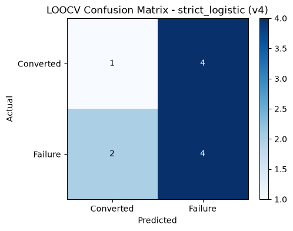
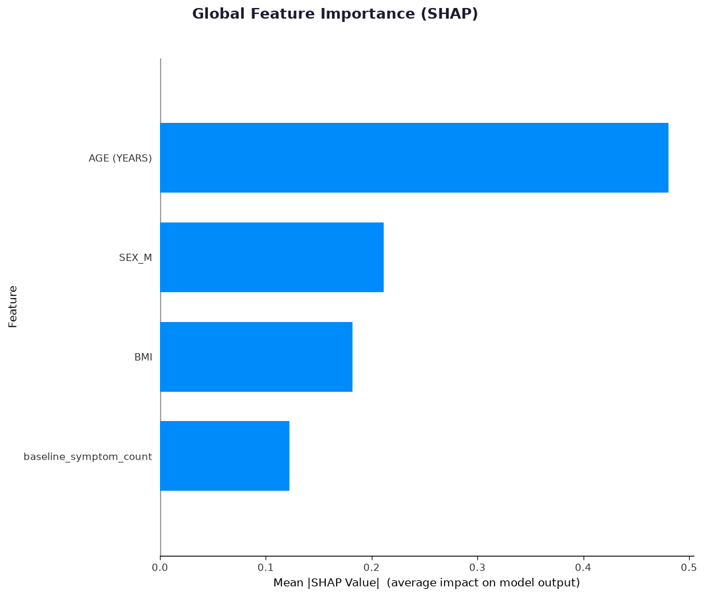
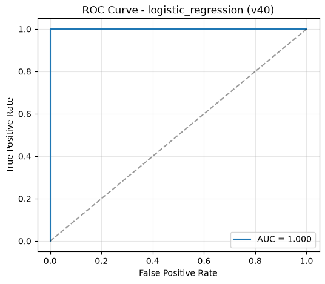
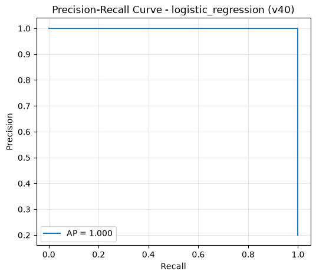
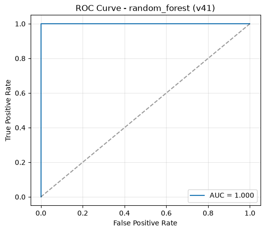
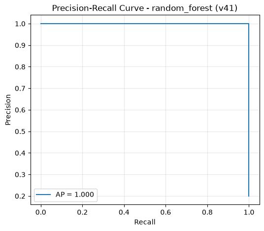
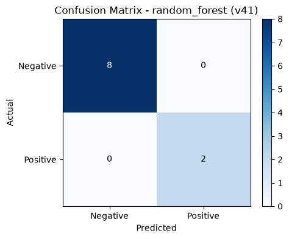
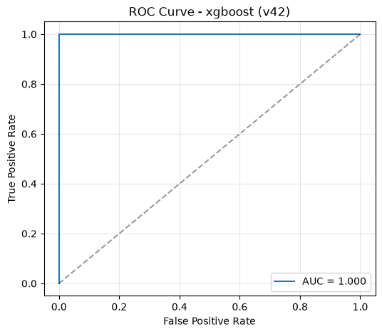
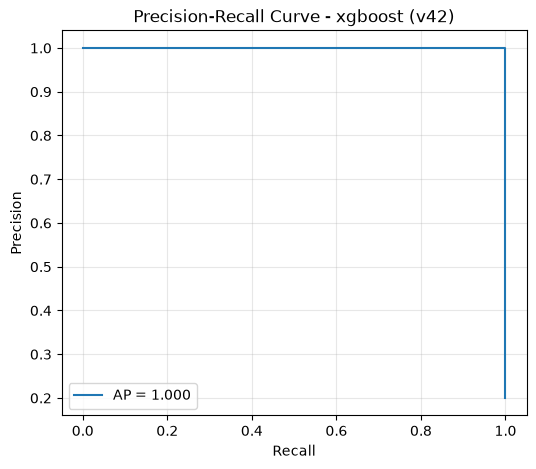
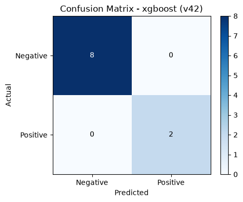

# TB Recovery Check — Results & EDA Report

> Machine learning models to predict tuberculosis treatment outcomes and identify at-risk household contacts, using cohort data from Kampala, Uganda.

---

## 1. Exploratory Data Analysis (EDA)

The EDA is in `notebooks/01_eda.ipynb`. Key findings:

- **Aim 1 (Patients)**: 218 patients, only 11 with M2 culture results (5.0%), 3 with M5 culture results (1.4%)
- **Aim 2 (Contacts)**: 46 healthy contacts, no longitudinal outcome data
- **Class imbalance**: ~97% majority class (imputed converted) in Aim 1 imputed dataset
- **Missing data**: High missingness in culture outcomes, moderate in BMI (23%), low in demographics

---

## 1. Aim 1 — Strict Model (Exploratory)

**Goal**: Predict non-conversion at month 2 using only confirmed culture results.

| Component | Detail |
|---|---|
| **Samples** | 11 patients with confirmed M2 culture results |
| **Outcome** | Culture-based: `No Growth`/`Negative` → 0, `Positive` → 1 |
| **Features** | AGE, BMI, SEX, baseline_symptom_count |
| **Model** | Logistic Regression, L2 regularization, class_weight="balanced" |
| **Cross-validation** | Leave-One-Out (LOOCV) |

### Results

| Metric | Value |
|---|---|
| LOOCV AUC | 0.133 |
| Accuracy | 0.455 (5/11 correct) |
| Precision | 0.500 |
| Recall | 0.667 |
| F1 | 0.571 |

**Confusion Matrix (LOOCV):**



**SHAP Summary (Strict Model):**



---

## 2. Aim 1 — Imputed Model (Sensitivity Analysis)

**Goal**: Predict non-conversion using all 218 patients (missing outcomes imputed as converted).

| Component | Detail |
|---|---|
| **Samples** | 218 patients (207 imputed as converted, 11 confirmed) |
| **Outcome** | `TARGET_NON_CONVERSION_ANY` — M2/M5 culture max, missing filled as 0 |
| **Features** | 18 baseline features (demographics, symptoms, comorbidities) |
| **Models** | Logistic Regression, Random Forest, XGBoost |
| **Cross-validation** | 5-fold stratified |
| **SMOTE** | Disabled |

### Results Summary

| Model | Train AUC | CV AUC (mean) | CV AUC (std) | Accuracy | Precision | Recall |
|---|---|---|---|---|---|---|
| Logistic Regression | 0.800 | **0.158** | 0.078 | 0.748 | 0.000 | 0.000 |
| Random Forest (champion) | 0.995 | **0.554** | 0.187 | 0.881 | 0.045 | 0.167 |
| XGBoost | 1.000 | **0.294** | 0.069 | 0.940 | 0.000 | 0.000 |

**Key insight**: The high train AUC vs low CV AUC reveals severe overfitting. The 97% imputed majority class drives accuracy, but precision on the failure class is near zero.

### SHAP Feature Importance (XGBoost v63)


Top features: AGE, BMI, TEMPERATURE_CELCIUS, TB_CONTACT, NUMBER_OF_OCCUPANTS

---

## 3. Aim 1 — Strict Model (Exploratory, n=11)

**Goal**: Predict non-conversion using only confirmed culture labels.

| Component | Detail |
|---|---|
| **Samples** | 11 patients with confirmed M2 culture results |
| **Outcome** | Culture-based: No Growth/Negative → 0, Positive → 1 |
| **Features** | AGE, BMI, SEX, baseline_symptom_count |
| **Model** | Logistic Regression, L2 regularization, class_weight="balanced" |
| **Cross-validation** | Leave-One-Out (LOOCV) |

### Results

| Metric | Value |
|---|---|
| LOOCV AUC | 0.133 |
| Accuracy | 0.455 (5/11 correct) |
| Precision | 0.500 |
| Recall | 0.667 |
| F1 | 0.571 |

**Confusion Matrix:**


**SHAP Summary (Strict Model):**


---

## 4. Aim 2 — Contact Risk (Proof-of-Concept)

**Goal**: Identify contacts at risk of developing TB or resistant to infection.

| Component | Detail |
|---|---|
| **Samples** | 46 contacts (36 after cleaning) |
| **Outcome** | `TARGET_SYMPTOM_PRESENT` — derived from symptom columns |
| **Features** | 12 features (AGE, SEX, WEIGHT, TEMPERATURE, COUGH, FEVER, WEIGHT LOSS, NIGHT SWEATS, DYSPNEA, CHEST PAIN, HEMOPTYSIS, HIV STATUS) |
| **Models** | Logistic Regression, Random Forest, XGBoost |
| **Cross-validation** | 5-fold stratified |

**⚠️ Target Leakage Warning**: The target is derived from the same symptom columns used as features. Perfect metrics are meaningless for TB risk prediction.

### Results

| Model | CV AUC | Accuracy | Precision | Recall |
|---|---|---|---|---|
| Logistic Regression (v40) | 1.000 | 0.944 | 0.800 | 1.000 |
| Random Forest (v41) | 1.000 | 1.000 | 1.000 | 1.000 |
| XGBoost (v42) | 1.000 | 1.000 | 1.000 | 1.000 |

**Logistic Regression (v40):**

| ROC Curve | Precision-Recall | Confusion Matrix |
|---|---|---|
|  |  |  |

**Random Forest (v41):**

| ROC Curve | Precision-Recall | Confusion Matrix |
|---|---|---|
|  |  |  |

**XGBoost (v42):**

| ROC Curve | Precision-Recall | Confusion Matrix |
|---|---|---|
|  |  |  |

### SHAP Feature Importance (Logistic Regression v40)


Top features: COUGH, WEIGHT, SEX, WEIGHT LOSS, TEMPERATURE

---

## 5. XAI (SHAP Analysis)

### Aim 1 — XGBoost v63 (Champion)

**SHAP Summary Bar:**


**Top 5 Features by Mean |SHAP|:**

| Rank | Feature | Mean |SHAP| |
|---|---|---|---|
| 1 | AGE (YEARS) | 2.064 |
| 2 | BMI | 1.278 |
| 3 | TEMPERATURE_CELCIUS | 1.109 |
| 4 | TB_CONTACT | 0.666 |
| 5 | NUMBER_OF_OCCUPANTS | 0.197 |

**Waterfall & Force Plots** (per-patient explanations):
- `reports/xai/aim1_non_conversion/xgboost_v63/waterfall_patient_0.png`
- `reports/xai/aim1_non_conversion/xgboost_v63/force_patient_0.png`
- (Similar for patients 1 and 2)

### Aim 2 — Logistic Regression v40

**SHAP Summary Bar:**


**Top Features by Mean |SHAP|:**

| Rank | Feature | Mean |SHAP| |
|---|---|---|---|
| 1 | COUGH | 0.331 |
| 2 | WEIGHT | 0.144 |
| 3 | SEX | 0.114 |
| 4 | WEIGHT LOSS | 0.051 |
| 5 | TEMPERATURE | 0.033 |

---

## 6. Data & Model Drift Monitoring

Drift detection infrastructure is implemented via MLflow (local file-based tracking).

### Data Drift Tests

| Feature type | Test | Alert threshold |
|---|---|---|
| Numerical | Kolmogorov–Smirnov | p < 0.05 |
| Numerical | Population Stability Index (PSI) | > 0.1 |
| Categorical | Chi-square | p < 0.05 |

Overall drift flagged when >30% of features show drift.

### Model Drift Tests

| Drift type | Metric | Threshold |
|---|---|---|
| Performance | AUC, precision, recall drop | > 0.05 vs champion baseline |
| Prediction distribution | PSI of prediction scores | > 0.1 |

### API Endpoints

| Method | Path | Description |
|---|---|---|
| `GET` | `/health` | Health check with deployed model versions |
| `POST` | `/predict/aim1` | Predict non-conversion risk (imputed model, 18 features) |
| `POST` | `/predict/aim1/strict` | Predict non-conversion risk (strict model, 4 features) |
| `POST` | `/predict/aim2` | Predict contact risk |
| `POST` | `/predict/batch` | Batch predictions from a list of instances |
| `POST` | `/predict/csv` | Upload CSV for batch predictions |
| `GET` | `/model/info` | Champion model metadata |
| `POST` | `/cache/clear` | Clear cached model instances |
| `POST` | `/monitor/data-drift` | Upload CSV, compare to reference data |
| `POST` | `/monitor/model-drift` | Upload CSV with labels, compare model performance |
| `GET` | `/monitor/report` | Retrieve latest drift report |
| `POST` | `/monitor/generate-synthetic` | Generate synthetic drifted data |

---

## 7. Model Version Control

Every training run produces versioned artifacts tracked in `models/registry/model_registry.csv`:

```
models/registry/
  model_registry.csv                  # Full lineage: model, version, params_hash,
                                      #   data_hash, CV metrics, timestamp
  aim1_non_conversion/                # Imputed model artifacts
    v59_random_forest.pkl             # Champion (CV AUC = 0.554)
    v60_xgboost.pkl
    v61_logistic_regression.pkl
  aim1_non_conversion_strict/         # Strict model artifacts
    v4_strict_logistic.pkl
  aim2_contact_risk/                  # Contact risk artifacts
    v40_logistic_regression.pkl
    v41_random_forest.pkl
    v42_xgboost.pkl
```

